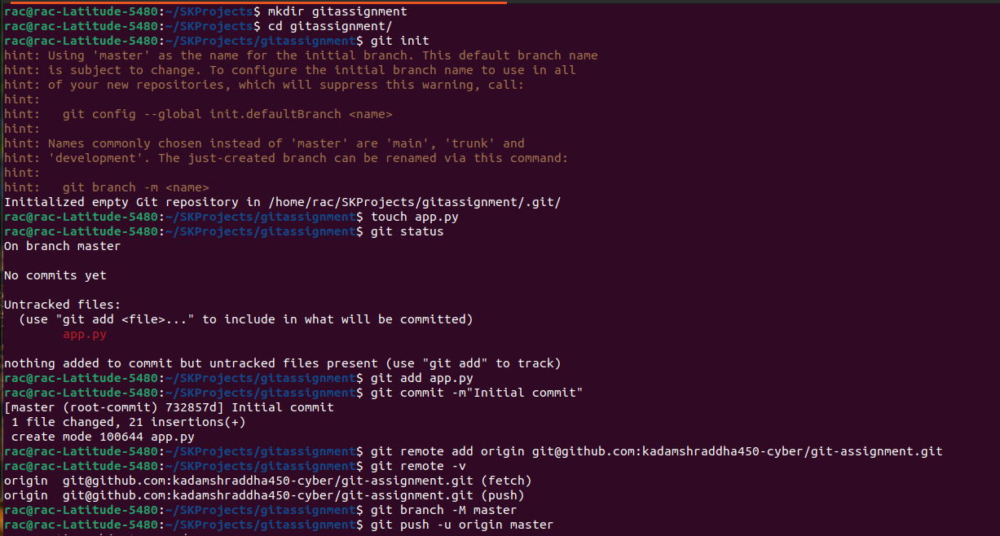
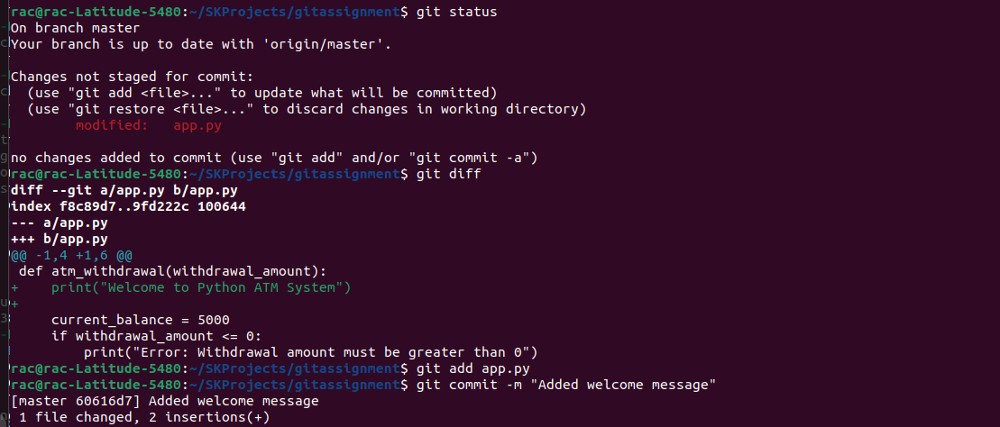
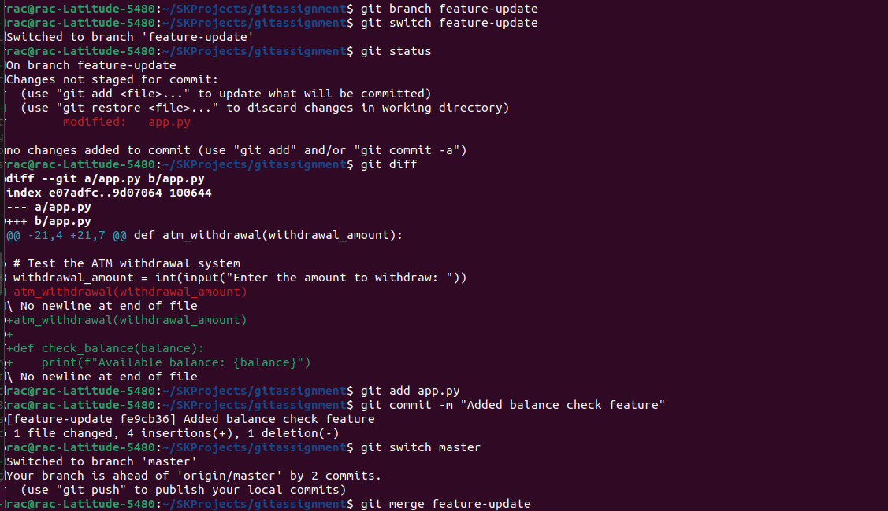
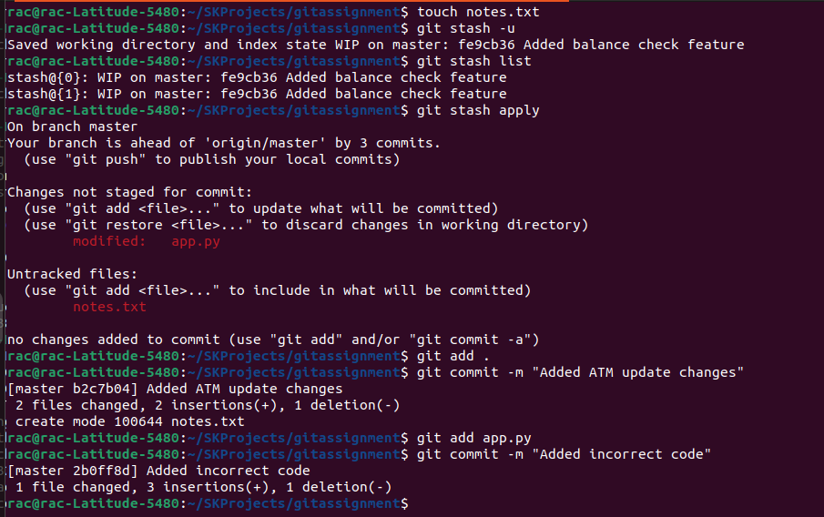

# Git & GitHub Practical Tasks

---

# Question 1: Git Project Setup

## Create Project Folder
Created a new project folder for the Python application.

## Initialize Git Repository

Initialized a new Git repository using `git init`.

## Create app.py File

Created the `app.py` file and added Python code.

## Check Git Status

Checked the current status of files in the repository.

## Stage Files
Added files to the staging area using `git add`.

---

## Commit Changes
Committed the project files with a meaningful commit message.

---

## Create Remote Repository
Created a remote repository on GitHub.

---

## Add Remote Origin
Connected the local repository to the GitHub repository.

---

## Verify Remote

Verified the configured remote repository.

## Push to GitHub

Pushed local project files to the remote repository.

---

.png)

# Question 2: Working with Changes & History

## Modify app.py
Added new functionality to the Python application.

---

## Check Changes
Checked modified files before staging changes.

---

## View Differences
Viewed differences between modified and previous code.

---

## Stage Specific Changes
Staged selected changes using partial staging.

---

## Commit Changes
Committed updated application changes.

---

## Second Change
Made another modification in the application.

---

## Stage All Changes
Added all updated files to staging.

---

## Second Commit
Created another commit with updated functionality.

---

## View Commit History
Viewed detailed Git commit history.

---

## One Line History
Viewed compact one-line commit history.

---

.png)

# Question 3: Branching & Feature Development

## Create Branch
Created a new feature branch for development.

---

## Switch Branch
Switched from main branch to feature branch.

---

## Feature Development
Added new feature logic in the feature branch.

---

## Commit Feature
Committed feature branch changes.

---

## Switch to Main
Switched back to the main branch.

---

## Merge Branch
Merged feature branch into the main branch.

---

## Verify Merge
Verified that feature changes were merged successfully.

---

## Delete Branch
Deleted the merged feature branch safely.

---

## Force Delete Branch
Force deleted a dummy branch using `-D`.

---

.png)
.png)

# Question 4: Handling Errors (Stash, Reset, Revert)

## Uncommitted Changes
Made changes in the project without committing them.

---

## Stash Changes
Stored temporary changes using Git stash.

---

## Stash List
Checked available stashed changes.

---

## Apply Stash
Restored stashed changes back to the working directory.

---

## Commit Stashed Work
Committed restored changes to the repository.

---

## Incorrect Commit
Created a commit containing incorrect code changes.

---

## Reset Commit
Undid the last commit using Git reset.

---

## New Commit
Created another corrected commit.

---

## Revert Commit
Reverted a previous commit by creating a reversing commit.

---

## Verify Final History
Verified the final commit history after reset and revert operations.

.png)
.png)
